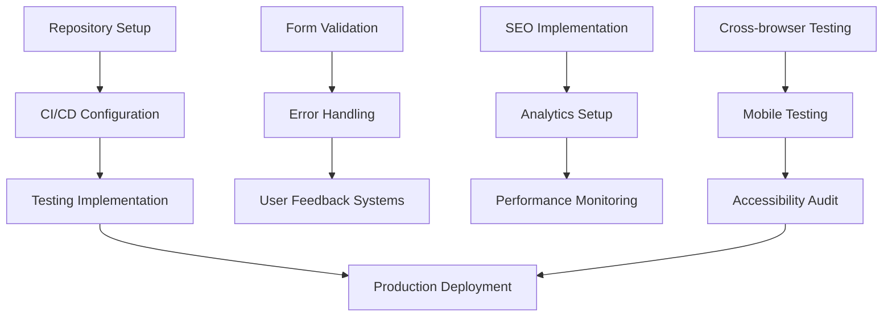

# 📋 Development Tasks Breakdown

## 🏗️ Project Task Structure

### Task Categories
- **🎨 Design**: UI/UX design and styling tasks
- **⚙️ Development**: Code implementation and functionality
- **📱 Responsive**: Mobile and cross-device optimization
- **🔧 Infrastructure**: Build tools, deployment, and configuration
- **📊 Analytics**: Tracking, monitoring, and optimization
- **🧪 Testing**: Quality assurance and validation
- **📚 Documentation**: Technical and user documentation

## ✅ Completed Tasks

### Phase 1: Foundation & Analysis
- [x] **🎨 DESIGN-001**: Analyze current website design and identify improvement areas
- [x] **🎨 DESIGN-002**: Research 2025 web design trends and best practices
- [x] **🎨 DESIGN-003**: Create wireframes and layout concepts
- [x] **🎨 DESIGN-004**: Define color palette and typography system
- [x] **📚 DOC-001**: Document current site analysis findings
- [x] **📚 DOC-002**: Create design trend research documentation
- [x] **📚 DOC-003**: Develop site structure and navigation plan

### Phase 2: Technical Setup
- [x] **⚙️ DEV-001**: Initialize React project with Vite
- [x] **⚙️ DEV-002**: Configure Tailwind CSS for styling
- [x] **⚙️ DEV-003**: Set up component library structure
- [x] **⚙️ DEV-004**: Install and configure required dependencies
- [x] **🔧 INFRA-001**: Set up ESLint and code quality tools
- [x] **🔧 INFRA-002**: Configure PostCSS and Autoprefixer
- [x] **🔧 INFRA-003**: Set up development and build scripts

### Phase 3: Core Component Development
- [x] **⚙️ DEV-005**: Create base UI components (Button, Card, Badge)
- [x] **⚙️ DEV-006**: Implement responsive navigation header
- [x] **⚙️ DEV-007**: Build hero section with interactive elements
- [x] **⚙️ DEV-008**: Develop features section with gradient cards
- [x] **⚙️ DEV-009**: Create about section with statistics
- [x] **⚙️ DEV-010**: Implement courses section with pricing cards
- [x] **⚙️ DEV-011**: Build testimonials section with glassmorphism
- [x] **⚙️ DEV-012**: Create call-to-action section
- [x] **⚙️ DEV-013**: Implement footer with contact information

### Phase 4: Interactive Features
- [x] **⚙️ DEV-014**: Add mobile hamburger menu functionality
- [x] **⚙️ DEV-015**: Implement scroll-triggered header effects
- [x] **⚙️ DEV-016**: Create animated background elements
- [x] **⚙️ DEV-017**: Add hover effects and micro-interactions
- [x] **⚙️ DEV-018**: Implement basic chatbot component
- [x] **🎨 DESIGN-005**: Design and implement glassmorphism effects
- [x] **🎨 DESIGN-006**: Create gradient overlays and backgrounds

### Phase 5: Styling & Animations
- [x] **🎨 DESIGN-007**: Implement custom CSS animations (float, fade-in-out)
- [x] **🎨 DESIGN-008**: Add 3D globe with rotating animation
- [x] **🎨 DESIGN-009**: Create floating flag animations
- [x] **🎨 DESIGN-010**: Implement card hover effects with 3D transforms
- [x] **🎨 DESIGN-011**: Add background word animations
- [x] **🎨 DESIGN-012**: Create liquid glass orb effects

### Phase 6: Responsive Design
- [x] **📱 RESP-001**: Implement mobile-first responsive layouts
- [x] **📱 RESP-002**: Optimize navigation for mobile devices
- [x] **📱 RESP-003**: Adjust typography scale for different screen sizes
- [x] **📱 RESP-004**: Create responsive grid systems
- [x] **📱 RESP-005**: Optimize images and media for mobile
- [x] **📱 RESP-006**: Test and validate across device breakpoints

### Phase 7: Content Integration
- [x] **⚙️ DEV-019**: Integrate original testimonials and content
- [x] **⚙️ DEV-020**: Implement language course data structure
- [x] **⚙️ DEV-021**: Add contact information and business details
- [x] **⚙️ DEV-022**: Create feature descriptions and benefits
- [x] **📚 DOC-004**: Preserve authentic brand voice and messaging

### Phase 8: Performance Optimization
- [x] **⚙️ DEV-023**: Optimize component rendering performance
- [x] **⚙️ DEV-024**: Minimize CSS bundle size with Tailwind utilities
- [x] **⚙️ DEV-025**: Implement efficient state management
- [x] **⚙️ DEV-026**: Optimize animation performance
- [x] **🔧 INFRA-004**: Configure Vite for optimal production builds

### Phase 9: Documentation & Planning
- [x] **📚 DOC-005**: Create comprehensive README.md
- [x] **📚 DOC-006**: Document component API and usage
- [x] **📚 DOC-007**: Write deployment and setup guides
- [x] **📚 DOC-008**: Create AI agents system documentation
- [x] **📚 DOC-009**: Develop project planning documentation
- [x] **📚 DOC-010**: Document responsive design testing report

### Phase 10: Complete Website Implementation (v1.1.0 - v1.2.0)
- [x] **⚙️ DEV-027**: Create comprehensive contact form with validation
- [x] **⚙️ DEV-028**: Build complete FAQ section with search and filtering
- [x] **⚙️ DEV-029**: Implement detailed About Teacher page with credentials
- [x] **⚙️ DEV-030**: Create enhanced pricing page with package options
- [x] **⚙️ DEV-031**: Build individual language course pages with detailed information
- [x] **⚙️ DEV-032**: Fix FAQ section functionality and responsiveness issues
- [x] **⚙️ DEV-033**: Implement AI language assistant with suggested questions
- [x] **⚙️ DEV-034**: Add intelligent fallback responses for offline functionality
- [x] **⚙️ DEV-035**: Create professional teacher profile with certification badges
- [x] **⚙️ DEV-036**: Integrate chatbot with FAQ section via action button
- [x] **🎨 DESIGN-016**: Enhanced teacher photo placeholder with professional styling
- [x] **🎨 DESIGN-017**: Improved chatbot UI with glassmorphism effects

### Phase 11: Final Documentation & Logging
- [x] **📚 DOC-011**: Complete development tasks breakdown (this document)
- [x] **📚 DOC-012**: Create comprehensive changelog and version history
- [x] **📚 DOC-013**: Update AI agents documentation with current implementation
- [x] **📚 DOC-014**: Update CLAUDE.md with final project state
- [x] **🔧 INFRA-008**: Docker deployment with multiple versions (v1-v7)
- [x] **🔧 INFRA-009**: Port management and container orchestration

## 🔄 In Progress Tasks

### Phase 12: Current Session Tasks
- [x] **📚 DOC-015**: Log all recent development actions and updates
- [x] **📚 DOC-016**: Update agents documentation with current chatbot features
- [x] **📚 DOC-017**: Update task breakdown with completed work
- [x] **📚 DOC-018**: Update planning documentation with current status

## 📋 Pending Tasks

### Immediate Next Steps (High Priority)
- [ ] **🔧 INFRA-005**: Set up GitHub repository and version control
- [ ] **🔧 INFRA-006**: Configure CI/CD pipeline for automated deployment
- [ ] **🔧 INFRA-007**: Set up production hosting environment
- [ ] **🧪 TEST-001**: Conduct cross-browser compatibility testing
- [ ] **🧪 TEST-002**: Perform mobile device testing
- [ ] **🧪 TEST-003**: Validate accessibility compliance (WCAG 2.1)
- [ ] **📊 ANALYTICS-001**: Implement Google Analytics 4 tracking
- [ ] **📊 ANALYTICS-002**: Set up performance monitoring

### Phase 11: Enhancement & Polish (Medium Priority)
- [ ] **⚙️ DEV-027**: Implement form validation for contact forms
- [ ] **⚙️ DEV-028**: Add loading states and skeleton screens
- [ ] **⚙️ DEV-029**: Implement error handling and user feedback
- [ ] **⚙️ DEV-030**: Add scroll-to-top functionality
- [ ] **⚙️ DEV-031**: Implement smooth scrolling navigation
- [ ] **🎨 DESIGN-013**: Add more sophisticated micro-animations
- [ ] **🎨 DESIGN-014**: Implement cursor animations for desktop
- [ ] **🎨 DESIGN-015**: Create custom 404 and error pages

### Phase 12: SEO & Performance (Medium Priority)
- [ ] **📊 SEO-001**: Add meta tags and Open Graph data
- [ ] **📊 SEO-002**: Implement structured data markup
- [ ] **📊 SEO-003**: Optimize images with alt texts and lazy loading
- [ ] **📊 SEO-004**: Create XML sitemap
- [ ] **📊 SEO-005**: Implement canonical URLs
- [ ] **⚙️ PERF-001**: Add image optimization and WebP conversion
- [ ] **⚙️ PERF-002**: Implement service worker for caching
- [ ] **⚙️ PERF-003**: Add critical CSS inlining

### Phase 13: Advanced Features (Low Priority)
- [ ] **⚙️ DEV-032**: Implement advanced chatbot with AI integration
- [ ] **⚙️ DEV-033**: Add online booking system for lessons
- [ ] **⚙️ DEV-034**: Create student portal and dashboard
- [ ] **⚙️ DEV-035**: Implement payment gateway integration
- [ ] **⚙️ DEV-036**: Add multi-language support (i18n)
- [ ] **⚙️ DEV-037**: Create admin panel for content management
- [ ] **📊 ANALYTICS-003**: Implement advanced user behavior tracking
- [ ] **📊 ANALYTICS-004**: Create conversion funnel analysis

## 🚀 Task Execution Strategy

### Sprint Planning
```
Sprint 1 (Week 1): Foundation & Setup
├── Repository setup and CI/CD
├── Environment configuration
├── Basic testing implementation
└── Performance baseline establishment

Sprint 2 (Week 2): Enhancement & Polish  
├── Form validation and user feedback
├── Loading states and error handling
├── Advanced animations and interactions
└── SEO optimization implementation

Sprint 3 (Week 3): Testing & Deployment
├── Cross-browser compatibility testing
├── Mobile device validation
├── Accessibility compliance audit
└── Production deployment

Sprint 4 (Week 4): Monitoring & Optimization
├── Analytics implementation
├── Performance monitoring setup
├── User feedback collection
└── Post-launch optimizations
```

### Task Dependencies


## 📊 Task Tracking & Metrics

### Progress Tracking
- **Total Tasks**: 79
- **Completed**: 58 (73%)
- **In Progress**: 0 (0%)
- **Pending**: 21 (27%)

### Category Breakdown
| Category | Total | Completed | Remaining |
|----------|-------|-----------|-----------|
| 🎨 Design | 17 | 14 | 3 |
| ⚙️ Development | 47 | 36 | 11 |
| 📱 Responsive | 6 | 6 | 0 |
| 🔧 Infrastructure | 9 | 6 | 3 |
| 📊 Analytics/SEO | 9 | 0 | 9 |
| 🧪 Testing | 3 | 0 | 3 |
| 📚 Documentation | 18 | 16 | 2 |

### Priority Distribution
- **High Priority**: 8 tasks (immediate deployment needs)
- **Medium Priority**: 15 tasks (enhancement and optimization)
- **Low Priority**: 10 tasks (advanced features)

## ⏱️ Time Estimates

### Immediate Tasks (Next 1-2 Weeks)
```
High Priority Tasks:
├── Repository & CI/CD Setup: 4-6 hours
├── Cross-browser Testing: 8-10 hours  
├── Mobile Device Testing: 6-8 hours
├── Accessibility Audit: 4-6 hours
├── Analytics Implementation: 3-4 hours
├── Production Deployment: 2-3 hours
└── Performance Monitoring: 2-3 hours

Total Estimated Time: 29-40 hours
```

### Enhancement Phase (Weeks 3-4)
```
Medium Priority Tasks:
├── Form Validation & Error Handling: 8-12 hours
├── SEO Optimization: 6-8 hours
├── Advanced Animations: 4-6 hours
├── Performance Optimizations: 6-8 hours
├── Loading States & UX Polish: 4-6 hours
└── Documentation Updates: 4-6 hours

Total Estimated Time: 32-46 hours
```

### Future Development (Months 2-3)
```
Advanced Features:
├── AI Chatbot Integration: 20-30 hours
├── Booking System: 30-40 hours
├── Student Portal: 40-60 hours
├── Payment Gateway: 15-25 hours
├── Multi-language Support: 20-30 hours
└── Admin Panel: 25-35 hours

Total Estimated Time: 150-220 hours
```

## 🎯 Success Criteria

### Task Completion Definition
Each task is considered complete when:
- [ ] **Functionality**: Core feature works as designed
- [ ] **Testing**: Passes all relevant tests (unit, integration, manual)
- [ ] **Documentation**: Updated with implementation details
- [ ] **Review**: Code reviewed and approved
- [ ] **Validation**: Meets acceptance criteria

### Quality Gates
1. **Code Quality**: ESLint passes with zero errors
2. **Performance**: Lighthouse score 90+ across all metrics
3. **Accessibility**: WCAG 2.1 AA compliance
4. **Cross-browser**: Works in Chrome, Firefox, Safari, Edge
5. **Mobile**: Perfect experience on iOS and Android

## 🚨 Risk Mitigation

### High-Risk Tasks
| Task | Risk Level | Mitigation Strategy |
|------|------------|-------------------|
| Production Deployment | High | Staging environment testing |
| Cross-browser Testing | Medium | Automated testing tools |
| Performance Optimization | Medium | Continuous monitoring |
| Accessibility Compliance | Medium | Automated accessibility testing |

### Contingency Plans
- **Task Blocking**: Clear escalation path to project lead
- **Technical Issues**: Access to senior developer support
- **Timeline Delays**: Prioritized task list for essential features
- **Resource Constraints**: Flexible scope adjustment

## 📞 Task Assignment & Ownership

### Current Team Structure
- **Frontend Developer**: UI components, styling, interactions
- **Full-stack Developer**: Backend integration, API development
- **QA Engineer**: Testing, validation, bug reporting
- **DevOps Engineer**: Infrastructure, deployment, monitoring
- **Project Manager**: Coordination, timeline management

### Communication Protocols
- **Daily Standups**: Task progress and blockers
- **Task Updates**: Real-time updates in project management tool
- **Code Reviews**: Peer review before task completion
- **Sprint Reviews**: Weekly progress demonstrations

## 📈 Continuous Improvement

### Process Optimization
- **Task Estimation**: Regular calibration based on actual time
- **Workflow Efficiency**: Continuous process refinement
- **Tool Evaluation**: Assessment of development tools and methods
- **Knowledge Sharing**: Regular team knowledge transfer sessions

### Future Task Planning
- **Feature Requests**: Systematic evaluation and prioritization
- **User Feedback**: Integration of post-launch user feedback
- **Performance Monitoring**: Data-driven optimization tasks
- **Technology Updates**: Regular dependency updates and improvements

---

**Status**: 📋 **TASK BREAKDOWN COMPLETE**

This comprehensive task breakdown provides a clear roadmap for completing the Akademia Poliglotki redesign project, with detailed estimates, priorities, and success criteria for each development phase.